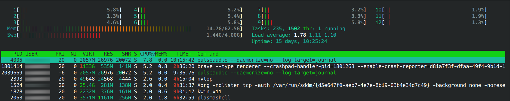
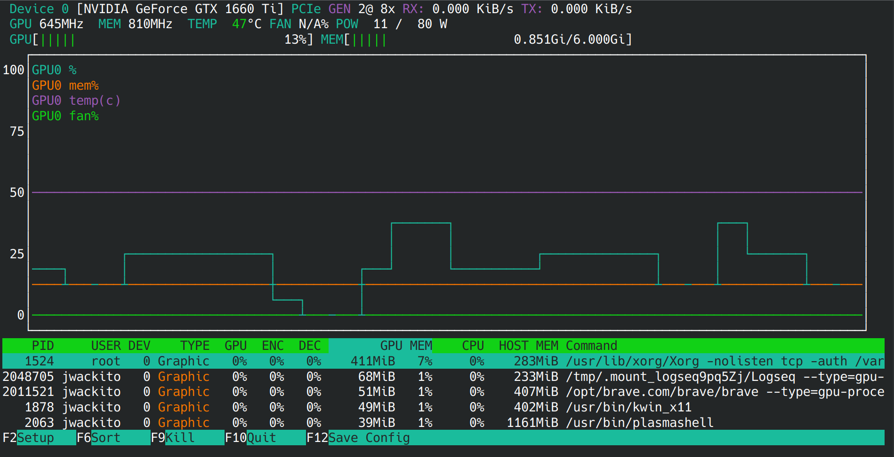
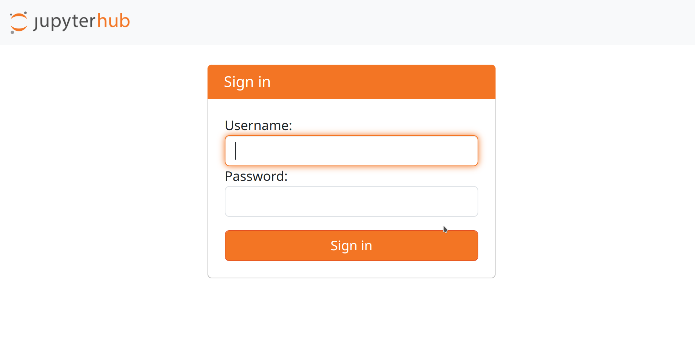

# Conda environments para todes
- ## Introdución
	- Paso a paso para instalar mi setup de Data Analysis ~~Conda Environments~~ como a mi me gusta. Esto incluye `Conda`, `Jupyter Hub/Lab` en modo servidor para varios usuarios, los `drivers de nvidia` si tenes GPUs discretas para hacer cómputo, algunas herramientas para monitorear el estado del sistema y ver que ande todo (`htop`, `nvtop`).
		- Based on this two awesome (but a bit outdated) tutorials
		- [Definitive Guide to Python Virtual Environments](https://www.whiteboxml.com/blog/the-definitive-guide-to-python-virtual-environments-with-conda)
		- [The Definitive Data Scientist Environment Setup](https://www.whiteboxml.com/blog/the-definitive-data-scientist-environment-setup)
	- Pasos para Ubuntu 24.04 que deberían ser similares para otras distros.
	- Haré uso indistintamente de Anaconda, Miniconda y Conda, pero son cosas distintas. El tutorial ayuda a instalar Miniconda 3 y a usar Conda como gestor de environments.
	- Para todo el tutorial, asumo lo siguiente:
		- Estas usando bash. A pesar que hoy en día existe [otros shells más potentes](https://www.redswitches.com/blog/types-of-linux-shells/#8friendlyinteractiveshellfish) y que `conda` se integra bien con la mayoría de ellos, nunca he tenido tiempo de aprender a usarlos. Si seguis estos pasos usando otro shell y encontras diferencias, por favor submitea un pull request.
		- `$HOME` hace referencia al home del usuario, normalmente `/home/<nombre_de_usuario>`. Esta es una variable de entorno definida en Linux que puede verse con el comando `echo $HOME`.
		- `$MINI3HOME` hace referencia al directorio de instalación de Miniconda 3, normalmente `$HOME/miniconda3`. Al contrario, esta no es una variable de entorno definida en Linux, sino solo una referencia a la carpeta donde se instala miniconda con el propósito de este tutorial.
	- Ante cualquier error u omisión, no dudes en mandarme un pull request.
- ## Instalar miniconda 3
	- Ir a [la doc de miniconda](https://docs.anaconda.com/miniconda/) y bajar la última versión del script de instalación. Normalmente disponible en el enlace
		- [Miniconda3-latest-Linux-x86_64.sh](https://repo.anaconda.com/miniconda/Miniconda3-latest-Linux-x86_64.sh)
	- ```bash
	  wget https://repo.anaconda.com/miniconda/Miniconda3-latest-Linux-x86_64.sh
	  bash Miniconda3-latest-Linux-x86_64.sh
	  ```
	- Lo primero es leer y aceptar la licencia.
	- Luego script pregunta donde se desea instalar miniconda. En mi caso dejé la opción por defecto, `$HOME/miniconda3` pero podría ser cualquier otra carpeta. Sea cual sea la que hayas elegido, a partir de ahora voy a llamarlo `$MINI3HOME`.
	- Una vez que se ha instalado todo, el script pregunta si se desea que conda active el entorno por defecto, `base`, cada vez que arranca el shell. Esto básicamente escribe una sección nueva en el archivo `$HOME/.bashrc`, que gobierna como se comporta bash al iniciar la sesión para un usuario. Yo soy bastante celoso de mi `.bashrc`, por eso entiendo que puedas querer contestar que no, pero es seguro decir que si. Lo que va a hacer es iniciar el environment `base` cada vez que arranque una sesión en la terminal, vayas a usar conda o no. La sección que se agrega tiene la pinta de lo que sigue
	- ```bash
	  # >>> conda initialize >>>
	  # !! Contents within this block are managed by 'conda init' !!
	  __conda_setup="$('/home/<username>/miniconda3/bin/conda' 'shell.bash' 'hook' 2> /dev/null)"
	  if [ $? -eq 0 ]; then
	      eval "$__conda_setup"
	  else
	      if [ -f "/home/<username>/miniconda3/etc/profile.d/conda.sh" ]; then
	          . "/home/<username>/miniconda3/etc/profile.d/conda.sh"
	      else
	          export PATH="/home/<username>/miniconda3/bin:$PATH"
	      fi
	  fi
	  unset __conda_setup
	  # <<< conda initialize <<<
	  ```
	- Si pusiste que si, entonces listo. Al abrir una nueva sesión de shell (o una nueva pestaña del terminal) deberías ver `(base)` en el prompt.
	- ```
	  (base) <username>@<host>:~$
	  ```
	- Esto quiere decir que `conda` esta activo y funcionando, y que se cargó el environment `base` que por defecto es un environment mínimo del cual todos los demás environments heredan.
	- ```
	  (base) <username>@<host>:~$ conda
	  usage: conda [-h] [-v] [--no-plugins] [-V] COMMAND ...
	  
	  conda is a tool for managing and deploying applications, environments and packages.
	  
	  options:
	    -h, --help          Show this help message and exit.
	    -v, --verbose       Can be used multiple times. Once for detailed output, twice for INFO logging, thrice for DEBUG logging, four times for TRACE logging.
	    --no-plugins        Disable all plugins that are not built into conda.
	    -V, --version       Show the conda version number and exit.
	  
	  commands:
	    The following built-in and plugins subcommands are available.
	  
	    COMMAND
	      activate          Activate a conda environment.
	      clean             Remove unused packages and caches.
	      compare           Compare packages between conda environments.
	      config            Modify configuration values in .condarc.
	      content-trust     Signing and verification tools for Conda
	      create            Create a new conda environment from a list of specified packages.
	      deactivate        Deactivate the current active conda environment.
	      doctor            Display a health report for your environment.
	      export            Export a given environment
	      info              Display information about current conda install.
	      init              Initialize conda for shell interaction.
	      install           Install a list of packages into a specified conda environment.
	      list              List installed packages in a conda environment.
	      notices           Retrieve latest channel notifications.
	      package           Create low-level conda packages. (EXPERIMENTAL)
	      remove (uninstall)
	                        Remove a list of packages from a specified conda environment.
	      rename            Rename an existing environment.
	      repoquery         Advanced search for repodata.
	      run               Run an executable in a conda environment.
	      search            Search for packages and display associated information using the MatchSpec format.
	      update (upgrade)  Update conda packages to the latest compatible version.
	  ```
	- El comando `conda info` muestra información acerca del environment que está activo y los paths a los archivos de configuración por defecto. Esto es super importante, sobre todo la ubicación del archivo `.condarc`, el path para los environments por defecto, etc.
- ## Creando y activando environments en `conda`
	- `conda` instala por defecto un enviroment que se llama `base`. De hecho, `conda` está instalado en este environment como una librería más. Si bien es posible instalar paquetes y librerías en este environment, no puedo dejar de expresar mi más profundo apoyo al consejo del tutorial de [WhiteBox](https://www.whiteboxml.com/blog/the-definitive-guide-to-python-virtual-environments-with-conda)...
		- ```
		  Don't mess with the base environment.
		  ```
	- Primero vamos a crear un nuevo environment llamado mlbase
		- ```
		  conda create -n mlbase
		  ```
	- Esto solo crea el environment pero no lo activa. Para instalar paquetes y librerías en un environment primero debe activarse usando `conda activate`
		- ```
		  conda activate mlbase
		  ```
	- La marca del environment activo del prompt debería cambiar de `(base)` a `(mlbase)`. Todo lo que hagamos a partir de ahora afectará directamente al environment `mlbase` mientras que el environment `base` no será modificado. Para volver al environment `base` basta con ejecutar `conda deactivate` y la marca del environment activo volverá a `(base)`
		- ```
		  conda deactivate
		  ```
	- Para eliminar un environment y todo el cache de archivos descargados
		- ```
		  conda env remove -n <environment_name>
		  conda clean --all
		  ```
- ## Instalando paquetes y librerías
	- Para instalar paquetes o librerías en `conda`, existen varias maneras. Se puede usar `conda install` en cuyo caso se van a usar los canales (`channels`) de conda para obtener los paquetes, o `pip` para instalar paquetes de Python. Incluso se pueden usar otros gestores de paquetes como `apt` o `ckan` pero este turorial no va de eso.
	- Cuando creas un env nuevo, en principio está vacio. Esto quiere decir que no está instalado ni Python, ni `pip`, ni nada. Si dentro de un env recién creado podes hacer `python -c 'import datetime'` y no falla, es por que estás usando el Python del sistema operativo, versión incluida y todo.
		- ```
		  $ python --version
		   Python 3.9.18
		  ```
	- Primero entonces instala Python y `pip`. Para eso usa  el comando `conda install`. No olvides asegurarte de haber activado el environment correcto.
		- ```
		  conda activate mlbase
		  conda install python=3.10 pip
		  ```
		- Acá se puede especificar la versión particular de Python a instalar. Si no se pone nada, se asume la última. Ojo, que muchas librerías van corriendo de atrás y pueden tardar meses en tener disponible una versión para la última versión de Python. Yo en general, siempre uso una o dos versiones anteriores a la ultima. Se pueden ver las versiones con `conda search python`
	- A mi me gusta instalar con `pip` pero que también pueden instalarse paquetes y librerías utilizando `conda install`. Algunas requieren activar el canal `conda-forge`. Simplemente se activa pasando como argumento `-c` al momento de instalar. También funciona para buscar. Por ejemplo:
		- ```
		  conda install -c conda-forge jupyterhub
		  conda search -c conda-forge python
		  ```
	- ### Mis librerías por defecto
		- Mi pila de librerías y paquetes para data analysis consiste en las siguientes:
			- `numpy`: Librería de vectores y cálculo numérico. Es dependencia de la mayoría de los demás paquetes, así que puede obviarse.
			- `pandas`: Para trabajar con datasets.
			- `matplotlib`: Para hacer plots. Otres gustan más de seaborn y hasta plotly. Allá elles, pero son también opciones válidas e integran bien con JupyterHub.
			- `ipython`: Una consola interactiva de python con esteroides. Para probar cosas rápido es una masa y tiene mucha mágia (%magic).
			- `scipy`: Implementa varios algoritmos de optimización, por ejemplo para ajustar (fitting) polinomios.
			- `statsmodels`: Para cosas de estadística, por ejemplo, tests de hipótesis de todos los colores, distribuciones de probabilidad, analisis bayesiano, etc etc etc.
			- `scikit-learn`: Para modelos básicos (y no tan básicos) de Machine Learning.
			- ```
			  pip install numpy pandas matplotlib ipython scipy statsmodels scikit-learn
			  ```
		- ***Importante:*** No olvides activar el env antes de instalar nada. Primero lo creas y luego lo activas.
			- ```
			  conda create -n mlbase
			  conda activate mlbase
			  ```
		- ***Importante***: No utilices `pip` para instalar nada en un entorno recién creado. Primero instala Python y `pip` en el nuevo entorno usando `conda install`. De lo contrario, estarás instalando los paquetes usando el `pip` del sistema operativo y los paquetes que instalen van a terminar en el Python del sistema!
	- ### Otros paquetes
		- `htop`: En general, yo instalo `htop` que no viene por defecto en ubuntu. Es un visor de sistema que permite monitorear el consumo de recursos del sistema desde la terminal.
			- 
		- `nvtop`: Permite ver los recursos usados por la placa de video.
			- 
		- `vim`: Si, `vim` full. Si todavía usas `nano`, yo diría que ya es hora que vayas haciéndote adulte. Y si usas `emacs`, yo diría que también le dejes lugar a tu niñe interior.
		-
	- ### Los drivers de Nvidia
		- Yo instalo los de la distribución, lo cual está super recontra desaconsejado. Muchos instalan los bajados de la página de Nvidia y yo muchas veces lo hice. Pero al final me dio más dolores de cabeza que soluciones. Lo cierto es que si instalan los drivers de la distribución y pueden ver la tarjeta gráfica con nvidia-smi, entonces ya todo anda. Al momendo de escribir este tutorial, estoy usando Kubuntu 24.04 y los últimos drivers disponibles son los del paquete `nvidia-driver-550`.
			- ```bash
			  sudo apt install nvidia-driver-550
			  ```
			- ```
			   $ nvidia-smi
			  Sat Jun 22 22:21:34 2024       
			  +-----------------------------------------------------------------------------------------+
			  | NVIDIA-SMI 550.67                 Driver Version: 550.67         CUDA Version: 12.4     |
			  |-----------------------------------------+------------------------+----------------------+
			  | GPU  Name                 Persistence-M | Bus-Id          Disp.A | Volatile Uncorr. ECC |
			  | Fan  Temp   Perf          Pwr:Usage/Cap |           Memory-Usage | GPU-Util  Compute M. |
			  |                                         |                        |               MIG M. |
			  |=========================================+========================+======================|
			  |   0  NVIDIA GeForce GTX 1660 Ti     Off |   00000000:01:00.0 Off |                  N/A |
			  | N/A   49C    P8              8W /   80W |     655MiB /   6144MiB |     17%      Default |
			  |                                         |                        |                  N/A |
			  +-----------------------------------------+------------------------+----------------------+
			                                                                                           
			  +-----------------------------------------------------------------------------------------+
			  | Processes:                                                                              |
			  |  GPU   GI   CI        PID   Type   Process name                              GPU Memory |
			  |        ID   ID                                                               Usage      |
			  |=========================================================================================|
			  |    0   N/A  N/A      1524      G   /usr/lib/xorg/Xorg                            426MiB |
			  ```
	- ### Configurando JupyterHub/Lab
		- Además, suelo querer usar JupyterHub/Lab local en mi computadora. Para eso, lo instalo usando `conda` en un environment para él solo. Además, con sugieren el tutorial de WhiteBox, instalo nodejs para poder instalar plugins,
			- ```
			  conda create -n jupyter
			  conda activate jupyter
			  conda install python pip
			  pip install conda-forge jupyterhub jupyterlab nodejs
			  ```
		- JupyterHub permite editar y correr kernels de Python (usando diferentes environments) desde el navegador. A algunos les resulta cómodo pero yo para muchas cosas prefiero Ipython. Lo bueno de JupyterHub es que tiene un Lab que permite administrar los notebooks en proyectos, administrar los kernels y otros chiches, todo desde el navegador. Además soporta muchos usuarios. Si estas usando este tutorial para configurar una máquina de cómputo compartida en una universidad por ejemplo, a tus usuarios les va a encantar. No es nada que no se pueda hacer con una terminal de `ssh` + `ipython`, pero la comodidad del navegador vende.
		- Lo interesante es que además puede dejarse corriendo como un servicio, de manera similar a lo que hace [TLJH](https://tljh.jupyter.org/en/latest/index.html) pero sin las restricciones de este último.
		- Una vez instalado, hay que configurarlo. Para eso, ejecuta el comando siguiente
			- ```
			  jupyterhub --generate-config
			  ```
			- Esto crea un archivo con la configuración por defecto llamado `jupyterhub_config.py`
			- Con vim, edita las siguientes variables (no olvides cambiar `<your_user>` por el nombre de tu usuario de linux y <your_domain.tld>) por el nombre de dominio que va a servir tu JupyterHub (podes conseguir alguno por menos de un dolar en namecheap o godaddy o incluso algunos .org.ar gratis en nic.ar):
				- ```python
				  c.JupyterHub.active_server_limit = 10
				  c.JupyterHub.allow_named_servers = True
				  c.JupyterHub.bind_url = 'https://:8443' # Si, vamos a configurar esto con https, como debe ser!
				  c.JupyterHub.load_roles = [{'name':'admin', 'users': ['<your_user>']}]
				  c.JupyterHub.ssl_cert = '/etc/letsencrypt/live/<your_domain.tld>/fullchain.pem'
				  c.JupyterHub.ssl_key = '/etc/letsencrypt/live/<your_domain.tld>/privkey.pem'
				  c.Authenticator.allow_all = True
				  c.Authenticator.allow_existing_users = True
				  c.Authenticator.reset_managed_roles_on_startup = True
				  ```
			- Una vez editado, mueve el archivo a la carpeta `$MINI3HOME/envs/jupyter/etc/config.py`
				- ```bash
				  mv jupyterhub_config.py $HOME/miniconda3/envs/jupyter/etc/config.py
				  ```
		- #### LetsEncrypt
			- Para pedir el certificado y poder servir JupyterHub usando el protocolo encriptado HTTPS, yo uso [LetsEncrypt](https://letsencrypt.org/es/getting-started/) . Es gratis y fácil de usar y la documentación es bastante fácil de seguir. En definitiva lo que hay que hacer es registrar un nombre de dominio para nuestro sitio. Yo usé namecheap y me dió bastante buenos resultados, pero yo soy un salame configurando DNS. Desde la misma interfaz de namecheap se puede hacer y básicamente que crear un registro de tipo A que sea wildcard `@` y que apunte a la IP de nuestro servidor de JupyterHub.
			- Luego hay que instalar [certbot](https://certbot.eff.org/instructions?ws=other&os=pip&tab=standard), siempre dentro del environment `jupyter`
				- ```
				  pip install certbot
				  ```
			- y ejecutar como root
				- ```
				  sudo $MINI3HOME/envs/jupyter/bin/certbot certonly --standalone
				  ```
			- Para que lo anterior funcione, el puerto 80 de la máquina debe ser alcanzable desde la Internet pública. Además de pedirte algunos datos como el email de contacto y poco más, certbot va a a crear los certificados para tu sitio en `/etc/letsencrypt/live/<your_domain.tld>/`. Estos son los archivos que enlazamos en la configuración de `jupyterhub_config.py` en las variables `ssl_cert` y `ssl_key`. Hay un paso más que tiene que ver con la renovación automática de los certificados, que debe hacerse una vez por mes. Para eso ejecuta `crontab -e` y agrega la siguiente linea:
				- ```crontab
				  0 0,12 * * * /home/<your_user>/miniconda3/envs/jupyter/bin/python -c 'import random; import time; time.sleep(random.random() * 3600)' && sudo /home/<your_user>/miniconda3/envs/jupyter/bin/certbot renew -q
				  ```
		- #### Opción sin LetsEncrypt
			- La verdad lo anterior es mejor y por lejos lo recomendado. Pero a lo mejor no tenes un dominio y no queres registrar uno. O estás corriendo esto en tu computadora portatil, en cuyo caso, tal vez ni siquiera sea necesario usar HTTPS (yo le pondría HTTPS igual, aunque sea para practicar).
			- La opción consiste en usar certificados autofirmados. Esa opción va más allá de esta guia pero podes empezar leyendo en la documentación de [JupyterHub Docs - Using an SSL Certificate](https://jupyterhub.readthedocs.io/en/stable/tutorial/getting-started/security-basics.html#using-an-ssl-certificate) y luego buscando como crear un Self Signed Certificate in Linux en tu buscador favorito. Los pasos para instalarlo son los mismos, pero un usuario que quiera conectarse a tu servidor de JupyterHub desde afuera recibirá una advertencia de que los certificados no son confiables. Sin embargo, la conexión estará encriptada de todas maneras :)
		- #### Corriendo JupyterHub como servicio de `systemd`
			- Una vez configurado JupyterHub, deberías poder ejecutarlo corriendo (siempre desde el `jupyter` environment).
				- ```
				  jupyterhub -f /home/<your_user>/miniconda3/envs/jupyter/etc/config.py
				  ```
				- Luego de esto, entrando a `https://yourdomain.tld:8443` deberías poder ver una pantalla como esta:
					- 
				- Y deberías poder loguearte usando el mismo usuario y password que usas para loguearte en tu Linux. Además, una vez logueado podras ir a `https://yourdomain.tld:8443/hub/admin`, donde podrás agregar y eliminar usuarios, ver quien está conectado, iniciar o parar kernels, etc. Have fun!!
			- Ahora vamos crear un servicio para que se inicie JupyterHub sin tener que ejecutar lo anterior cada vez.
				- Ejecuta el comando `sudo vim /etc/systemd/system/jupyterhub.service` y edita el contenido para que se vea como lo siguiente.
				- ```bash
				  [Unit]
				  Description=JupyterHub
				  After=network.target
				  [Service]
				  User=root
				  Environment="PATH=/bin:/usr/local/sbin:/usr/local/bin:/usr/sbin:/usr/bin:/home/<your_user>/miniconda3/envs/jupyter_env/bin:/home/<your_user>/miniconda3/bin"
				  ExecStart=/home/<your_user>/miniconda3/envs/jupyter_env/bin/jupyterhub -f /home/<your_user>/miniconda3/envs/jupyter/etc/config.py
				  [Install]
				  WantedBy=multi-user.target
				  ```
			- Cada vez que modifiques este archivo, hay que decirle a systemctl que hay un nuevo servicio registrado.
				- ```bash
				  sudo systemctl daemon-reload
				  ```
			- Para que el servicio esté habilitado, además hay que habilitarlo corriendo la siguiente linea. Esto solo es necesario una vez y no hace falta correrlo si el servicio `jupyterhub.service` se modifica.
				- ```bash
				  sudo systemctl enable jupyterhub
				  ```
			- Por último, solo hace falta iniciar el servicio.
				- ```bash
				  sudo systemctl start jupyterhub
				  ```
			- Si todo está bien, deberías poder ver algo así
				- ```bash
				  sudo systemctl status jupyterhub
				  [sudo] contraseña para <your_user>: 
				  ● jupyterhub.service - JupyterHub
				       Loaded: loaded (/etc/systemd/system/jupyterhub.service; enabled; preset: enabled)
				       Active: active (running) since Sat 2024-06-22 21:14:57 -03; 52min ago
				     Main PID: 9539 (jupyterhub)
				        Tasks: 18 (limit: 153434)
				       Memory: 209.4M (peak: 266.8M)
				          CPU: 36.678s
				       Y las últimas lineas de log de jupyterhub!!!
				  ```
